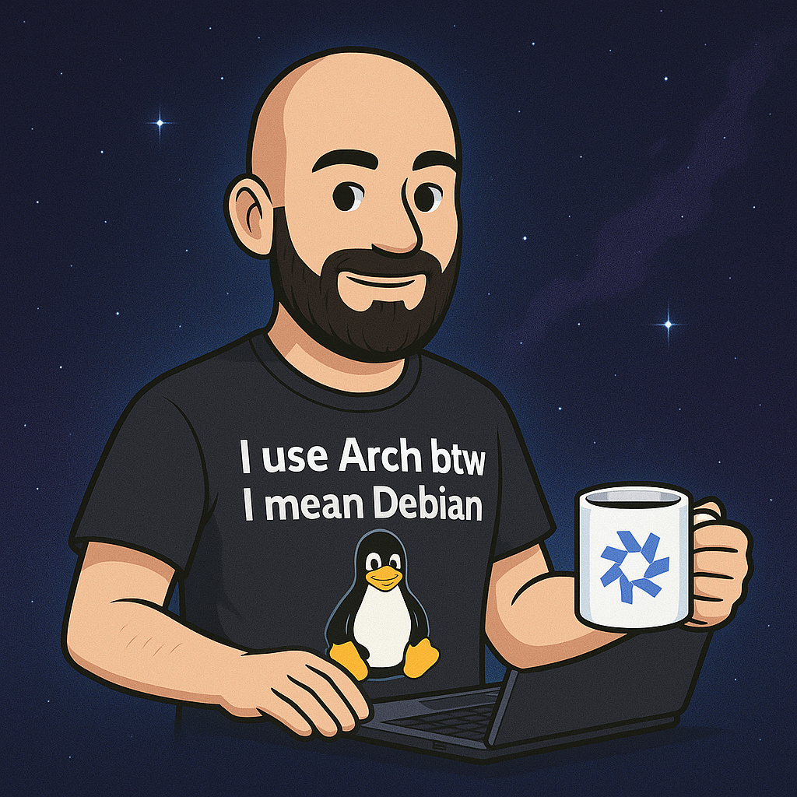

<!-- Google Verification -->
<meta name="google-site-verification" content="_m93-LDGjfdxXUD657jihKgUqjPPhLnrpgnneN9_GVU" />

  

# 👋 I’m Dennis — currently running 3 distros and zero stability  
🐧 Penguin enthusiast. I maintain more Linux projects than actual humans.  
💽 Creator of:  
&nbsp;&nbsp;&nbsp;• **[Project Maxwell](https://github.com/dennishilk/Project-Maxwell)** (coming soon™)  
&nbsp;&nbsp;&nbsp;• **Nebunix OS** (runs better than my life)  
&nbsp;&nbsp;&nbsp;• **Penguin Power Plant** (educates you, bullies you)  

🛠 **My scripts have 3 states:**  
&nbsp;&nbsp;&nbsp;1) works  
&nbsp;&nbsp;&nbsp;2) almost works  
&nbsp;&nbsp;&nbsp;3) why is everything on fire??  

⚙️ Arch btw, Debian enjoyer, NixOS victim  
🧪 90% of my projects start with *“What if I…?”*  
💀 100% of my bugs are caused by me  

⚡ **sudo holdmyteacup** — the next revolution in doing absolutely nothing  
☕ Powered by East Frisian tea and terrible decisions  
🚀 *Warning: cloning any repo may cause your system to run faster than intended.*  

---

---

# 📊 Linux Nerd Stats

| Category | Value |
|---------|-------|
| Distros Daily-Driven | 3 (too many) |
| Penguins Owned | Infinite |
| Coffee | 0 |
| East Frisian Tea | **9999+** |
| Number of “What if…?” Projects | increasing |
| Times I broke NixOS | yes |
| Number of repos that “almost work” | all of them |

---

# 🔭 Current Projects

- 🐧 **Nebunix OS** — in progress  
- 🐧 **Project Maxwell** — in progress  
- 🐧 **Penguin Power Plant** — in progress  
- 🧩 [Backup/Restore tool for DWM](https://github.com/dennishilk/backup-restore-dwm)  
- ⚙️ [Linux Gaming Toolkit](https://github.com/dennishilk/linux-gaming-toolkit)  
- 🔊 [SPDIF Soundfix](https://github.com/dennishilk/spdif-fix)  
- 🪐 [Debian 13 Nvidia Driver](https://github.com/dennishilk/nvidia-driver)  

---  

  

---

# 💬 About  
I focus on minimal, high-performance Linux environments for developers and gamers.  
Everything I build is open-source and optimized for **Debian**, **Arch**, and **NixOS**.  

---

# ☕ Buy Me a Tea  
*(I only drink East Frisian tea — nothing else.)*

---

<!--
**dennishilk/dennishilk** is a ✨ special ✨ repository because its `README.md` appears on your GitHub profile.
-->

